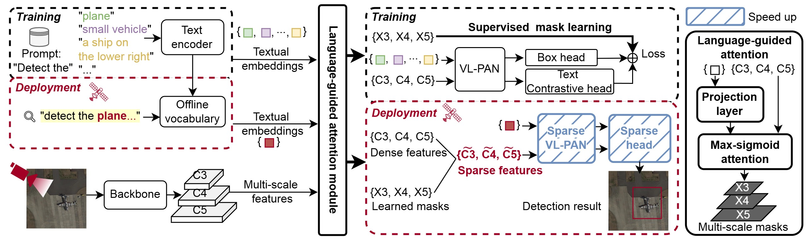

# VISO
This is the official implementation of our paper VISO: Accelerating In-orbit Object Detection with Language-Guided Mask Learning and Sparse Inference.

## 🔥Updates
`[2025-10-24]:` We release VISO, which includes pre-trained weights, pre-trained data, training code, and sparse inference code.

## Overview

In-orbit object detection is essential for Earth observation missions on satellites equipped with GPUs.A promising approach is to use pre-trained vision-language modeling (VLM) to enhance its open-vocabulary capability. However, adopting it on satellites poses two challenges: (1) satellite imagery differs substantially from natural images, and (2) satellites' embedded GPUs are insufficient for complex models' inference. We reveal their lack of a crucial prior: in-orbit detection involves identifying a set of known objects within a cluttered yet monotonous background. Motivated by this observation, we propose VISO, a Vision-language Instructed Satellite Object detection model that focuses on object-specific features while suppressing irrelevant regions through language-guided mask learning. After pre-training on a large-scale satellite dataset with 3.4M region-text pairs, VISO enhances object-text alignment and object-centric features to improve detection accuracy. Also, VISO suppresses irrelevant regions, enabling highly sparse inference to accelerate speed on satellites. Extensive experiments show that VISO without sparsity outperforms state-of-the-art (SOTA) VLMs in zero-shot detection by increasing 34.1% AP and reducing 27× FLOPs, and surpasses specialist models in supervised object detection and object referring by improving 2.3% AP. When sparsifying VISO to a comparable AP, FLOPs can be greatly reduced by up to 8.5×. Real-world tests reveal that VISO achieves a 2.8–4.8× FPS speed-up on satellites’ embedded GPUs.

## Getting started
### 1. Installation
VISO is developed based on torch==2.0.0+cu118, mmcv==2.0.1, mmdet==3.0.0, mmengine==0.10.7, mmyolo==0.6.0, mmrotate==1.0.0rc1 (compiled from source). Check more details about requirements in [docs/installation](./docs/installation.md) (Coming soon).

### 2. Preparing Data

We provide the details about the pre-training data in [docs/data](./docs/data.md) (Coming soon).

## Training & Evaluation
```bash
chmod +x tools/dist_train.sh
./tools/dist_train.sh <path/to/config> <gpus>
```

**NOTE:** VISO is pre-trained on 8 GPUs (H800).
Evaluating VISO is also easy:

```bash
chmod +x tools/dist_test.sh
./tools/dist_test.sh <path/to/config> <path/to/weights> <gpus>
```
